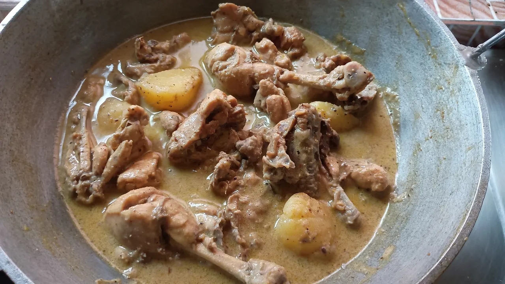
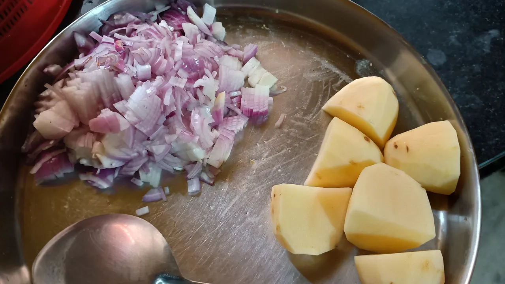
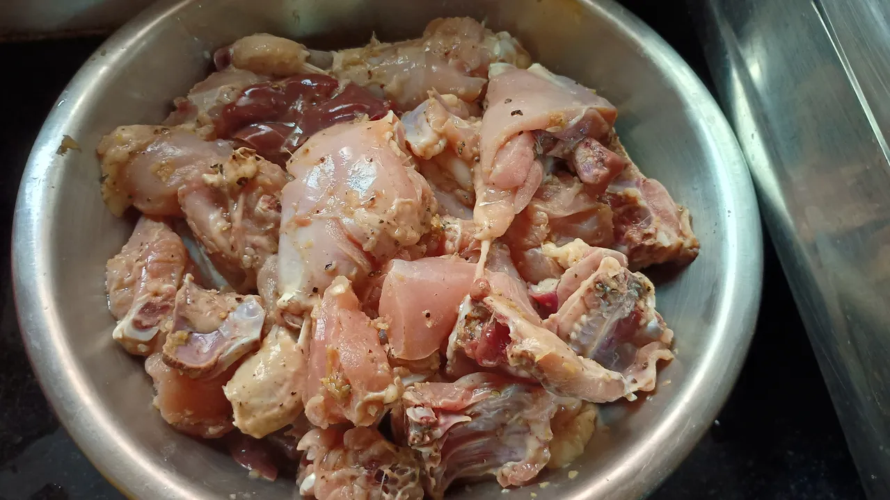
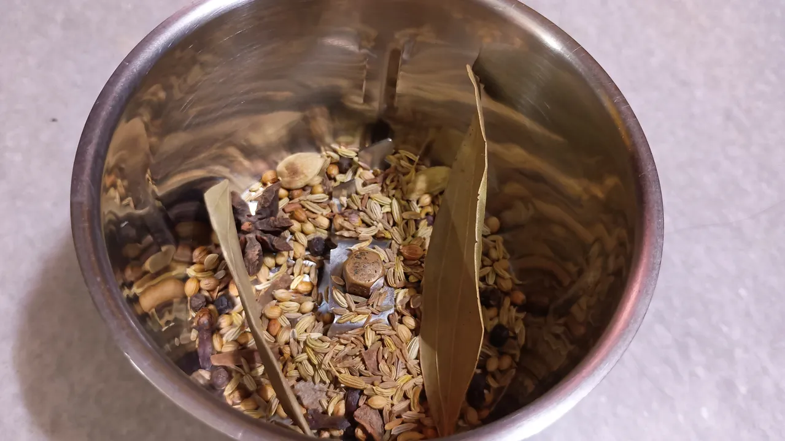

# 🍗 Chicken Maharani Recipe 👑
It is a tasty and healthy chicken recipe. It is easy to prepare and it gives a royal taste.

## 📜 Ingredients
You can change the proportion as per your need. Here `tbsp` is table spoon and `tsp` is tea spoon.

1. Chicken: 1kg
2. Milk: 200gm
3. Ginger garlic paste: 1 tbsp
4. Lemon juice: 1 tbsp
5. Salt
6. Black pepper powder: 1/2 tbsp
7. Whole garam masala items
8. Chopped onions (about 2-3 big sizes)
9. 1-2 green chillies
10. 8-10 cashew nuts
11. 6-8 almond (good if soaked in water and peeled)
12. Optional: Potato and coriander leaves

## 👨‍🍳 Cooking Process

### Mix & Marinate

* Put the chicken into a bowl, add the ginger garlic paste, lemon juice, pepper powder and 1/2 tsp salt.

* Mix well, cover the bowl and put it to marinate for 30 min to 1 hour.

### Prepare the Masalas

* Take some whole garam masala items which may include: 2 bay leaf, Dry chilli, Cloves, Cinnamon, Cardamom, Star anise, cumin, sauf etc.

* Take a dry kadai / pan, heat that a little, dry roast the masalas and then make a powder using a mixture grinder.

* Make a thick paste of little milk, cashew nuts, almonds and 1-2 green chillies.

### Cook it

* When your marination is complete, put some oil on the pan, heat that a little, then put the chopped onions on the pan. Fry till little brown.

* Then put your marinated chickens and fry / cook till the water dries.

* After that, put the dry masala powder, mix well. Then put your paste of nuts & milk. Add 30-50gm of yogurt / curd.

* Then add some milk and cook it till the chicken becomes soft. Add salt as per your taste. You may add some water too.

* Optional part: if you wanted to use potatos, you could add them while adding the masalas. At the end, put some chopped coriander leaves.

* Serve it with rice or rotis (indian bread).
