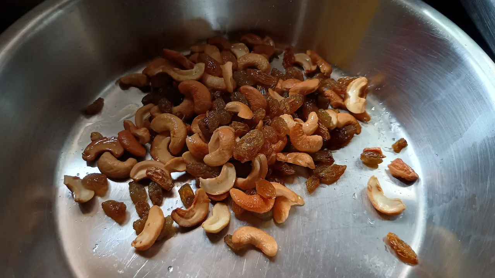
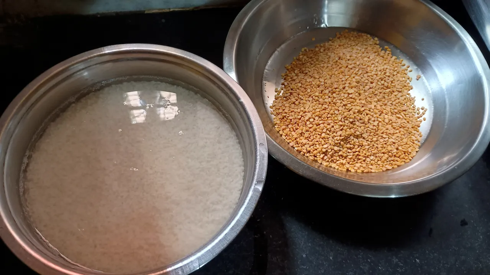
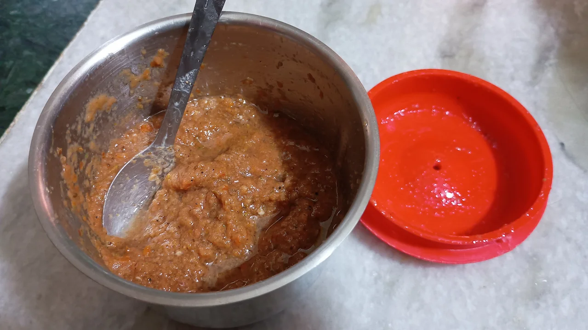

# Bhoger Khichuri (Pure Veg)
A quick and tasty veg recipe which you can prepare without any hassle.

## 📜 Ingredients
You can change the proportion as per your need. Here `tbsp` is table spoon and `tsp` is tea spoon.

1. Gobindobhog Rice - 250gm
2. Moong Daal - 150gm
3. Some Kaju (Cashew Nuts) & Kishmish (Raisins)
4. Tomato - 2 pc
5. Ginger - 1 inch
6. Jeera Whole (Cumin) - 1 tbsp
7. Radhuni - 1/2 tbsp
8. Green chillies - 2 pc (or as per your taste)
9. Whole Coriander Seeds - 1/2 tbsp
10. Bay leaves - 2 pc
11. Dry red chillies - 2 pc
12. Turmaric powder, a pinch of Hing, Ghee, Salt & Sugar

## 👨‍🍳 Cooking Process

### Dry roast or fry
* Dry roast the moong daal & place into a pot.
* Take some ghee and fry the kaju & kishmish a little.
  

### Soak into water
* Soak the rice into water for about 30 min.
  

### Making a paste
* Make a mooth paste of tomatoes, ginger, cumin, radhuni, coriander, green chillies.
  

### Making the full dish

* Take a big pot (handi), pour approx 2L water and boil it.
* Once the water starts boiling, add pinch of turmaric powder, put dry roasted moong dal and cook it till 80%.
* Then add the soaked rice and let it cook.
* Parallelly take a fry pan, put some oil. 
* Once the oil is heated put bay leaves, dry red chillies and fry them little bit.
* After that pour the entire paste, pinch of turmaric powder and keep steering until the oil is separated from the mixture.
* Once the rice is cooked about 90%, pour the fried mixture into the khichuri. Also add the fried kaju kishmis.
* Add salt and sugar as per your taste and cook it fully.

> Tips: You can add water during the cooking process if needed. Optionally you may add 1tbsp of pure ghee at the end while the khichuri is still hot.
